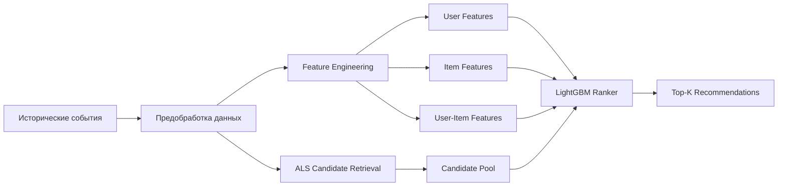
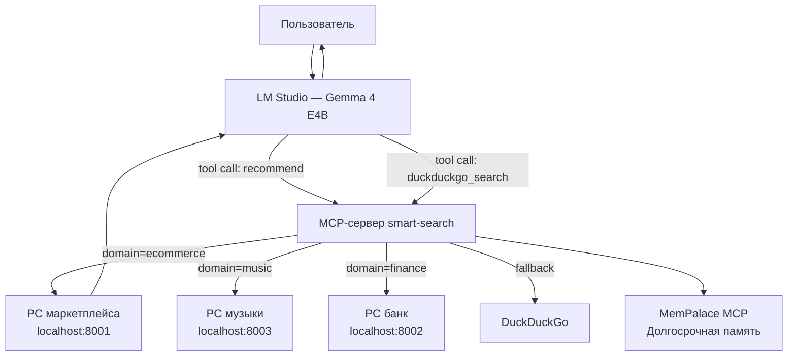
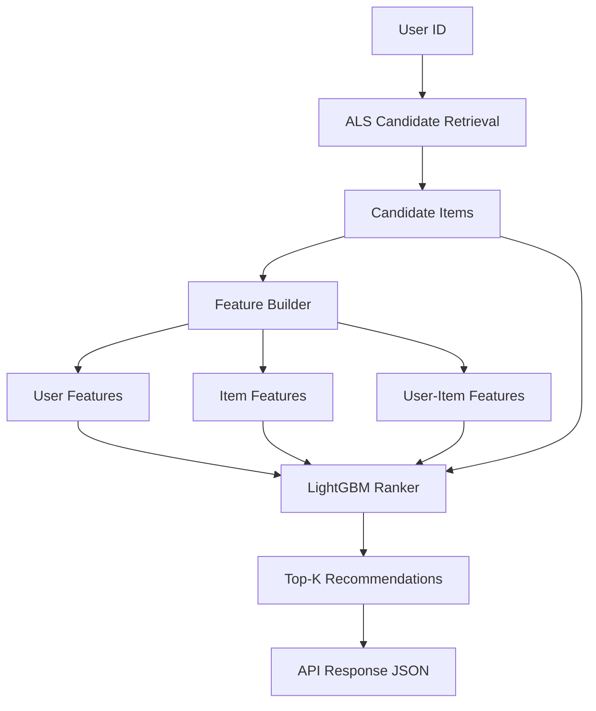
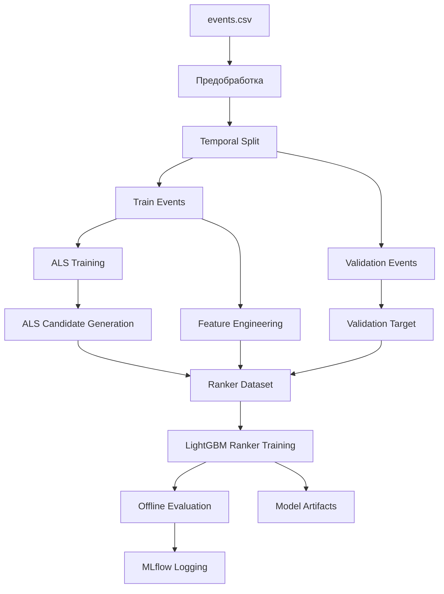
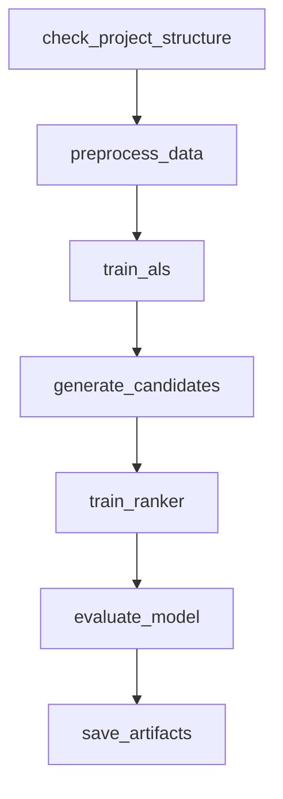
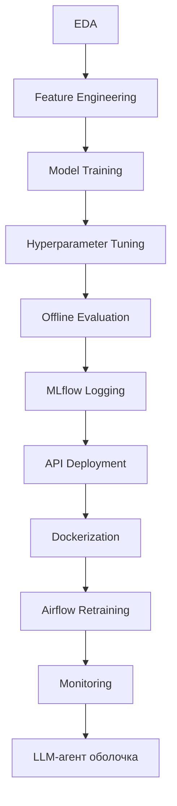

# 🛒 Рекомендации товаров в электронной коммерции

## Описание проекта

Цель проекта — построить production-ready рекомендательную систему для интернет-магазина, которая предсказывает наиболее релевантные товары для пользователя.

Проект покрывает полный ML lifecycle:

* исследование данных;
* feature engineering;
* обучение и сравнение моделей;
* hyperparameter tuning;
* логирование экспериментов;
* деплой API-сервиса;
* контейнеризация;
* автоматическое переобучение;
* мониторинг;
* документация и сопровождение.

---

## Архитектура системы



---

## Архитектура персонализированной оболочки с ИИ-ассистентом



**Компоненты оболочки:**

| Компонент | Технология | Назначение |
|-----------|-----------|------------|
| ИИ-агент | Gemma 4 E4B (Q4_K_M, 6.33 GB) | Оркестрация, объяснения |
| Inference backend | LM Studio | Локальный запуск LLM |
| Tool routing | MCP smart-search | Маршрутизация по доменам |
| РС маркетплейса | ALS + LightGBM Ranker | Персонализация товаров |
| Долгосрочная память | MemPalace (MCP) | Сохранение профиля |

---

## Данные

Используются три таблицы:

### `category_tree.csv`

Содержит иерархию категорий товаров:

* `parentid` — родительская категория
* `categoryid` — дочерняя категория

### `events.csv`

История пользовательских событий:

* `timestamp`
* `visitorid`
* `event`
* `itemid`
* `transactionid`

Типы событий:

* `view`
* `addtocart`
* `transaction`

### `item_properties.csv`

История изменения свойств товаров:

* `timestamp`
* `itemid`
* `property`
* `value`

---

## Постановка задачи

Необходимо рекомендовать пользователю товары, которые с высокой вероятностью приведут к добавлению в корзину.

### Целевое действие

Основной таргет:

* `addtocart`

Дополнительные сигналы:

* `transaction` — сильный позитивный сигнал
* `view` — слабый позитивный сигнал

Также из рекомендаций исключаются уже купленные товары.

---

## Метрики

### Offline Ranking Metrics

* Recall@K
* Precision@K
* MAP@K
* NDCG@K
* HitRate@K

Основная метрика:

* **Recall@10**

Дополнительные:

* MAP@10
* NDCG@10

---

### Business Metrics

* CTR рекомендаций
* Add-to-Cart Rate
* Conversion to Purchase
* GMV Uplift

---

## Подход к решению

Задача решается как **Learning-to-Rank**.

Используется двухэтапная архитектура:

```text
Candidate Generation → Ranking
```

---

## Candidate Generation

Используются retrieval-модели:

* Top Popular
* ALS
* Item-to-Item
* Recently Popular
* Category-Based

---

## Ranking

Используется модель:

* **LightGBM Ranker**

Признаки:

* user behavior features
* item popularity features
* user-item interaction features
* time/context features
* ALS score

---

## Inference Pipeline



---

## EDA

Основные выводы:

* высокая разреженность interaction matrix
* выраженный cold-start
* long-tail распределение пользователей и товаров
* `addtocart` — наиболее сильный proxy target
* вечер — пик пользовательской активности
* свойства товаров дают значимый прирост качества

Результат анализа:

* `notebooks/01_eda.ipynb`

---

## Эксперименты

Сравниваются модели:

* Top Popular
* ALS
* Two-Stage Hybrid Model

Результаты:

* `notebooks/02_modeling.ipynb`

---

## Ablation Study

| Model | Recall@10 |
|-------|-----------|
| ALS Only | baseline |
| Ranker without ALS score | improved |
| Ranker with ALS score | best |

Вывод:

> ALS score является важным дополнительным ranking-сигналом.

---

## Offline Training Pipeline



---

## MLflow

### Запуск сервера

```bash
mlflow server \
  --backend-store-uri sqlite:///mlflow.db \
  --default-artifact-root ./mlruns \
  --host 127.0.0.1 \
  --port 5000
```

### Логируются

* параметры моделей
* offline-метрики
* Optuna trials
* feature importance
* артефакты моделей

---

## API Service

Рекомендательная система развёрнута как FastAPI REST сервис.

### Endpoints

#### Healthcheck

```http
GET /health
```

#### Recommendations

```http
POST /recommend
```

Request:

```json
{
  "user_id": 257597,
  "top_k": 10,
  "n_candidates": 100
}
```

Response:

```json
{
  "user_id": 257597,
  "recommendations": [
    {
      "item_id": 3574,
      "score": 0.913,
      "als_score": 0.184,
      "categoryid": 1173
    }
  ]
}
```

### Swagger

```
http://localhost:8001/docs
```

---

## Docker

### Build & Run (через скрипт)

```bash
cd ~/.lmstudio/projects/ecommerce-recsys
bash scripts/run_docker.sh
```

### Build вручную

```bash
docker build -t ecommerce-recsys-api .
```

### Run вручную

```bash
docker run -d --name ecommerce-recsys-container -p 8001:8000 ecommerce-recsys-api
```

### Проверка

```bash
curl http://localhost:8001/health
# {"status":"ok"}
```

### Логи

```bash
docker logs ecommerce-recsys-container -f
```

---

## 🚀 Запуск персонализированной оболочки с ИИ-ассистентом

### Требования

* macOS с Apple Silicon (M1/M2/M3)
* Docker Desktop
* LM Studio с моделью `gemma-4-E4B-it-Q4_K_M.gguf`
* MCP-сервер `smart-search` установлен в LM Studio

---

### Шаг 1 — Запустить Docker Desktop

```
Spotlight (⌘+Space) → "Docker" → Enter
Ждать пока иконка кита в menu bar перестанет анимироваться
```

---

### Шаг 2 — Создать виртуальное окружение (только первый раз)

```bash
cd ~/.lmstudio/projects/ecommerce-recsys
python3 -m venv .venv
source .venv/bin/activate
pip install --upgrade pip
pip install -r requirements.txt
```

---

### Шаг 3 — Запустить РС маркетплейса

```bash
cd ~/.lmstudio/projects/ecommerce-recsys
source .venv/bin/activate
bash scripts/run_docker.sh
```

Проверка:

```bash
curl http://localhost:8001/health
# ожидаем: {"status":"ok"}
```

Тест рекомендаций напрямую:

```bash
curl -X POST http://localhost:8001/recommend \
  -H "Content-Type: application/json" \
  -d '{"user_id": 257597, "top_k": 5, "n_candidates": 50}'
```

---

### Шаг 4 — Запустить MCP-сервер (новое окно терминала)

```bash
cd ~/.lmstudio/extensions/mcp-server/search_server
source .venv/bin/activate
pip install ddgs httpx  # только первый раз
python3 test_integration.py  # проверка маршрутизации
```

Ожидаемый вывод:

```
[купить ноутбук] → recsys:ecommerce  domain=ecommerce  conf=0.85
[посоветуй плейлист] → duckduckgo    domain=music      conf=0.95
```

---

### Шаг 5 — Запустить LM Studio

```
1. Открыть LM Studio
2. Load Model → gemma-4-E4B-it-Q4_K_M.gguf → Load
3. Убедиться что в Integrations активны:
   ✅ mcp/smart-search (tools: recommend, duckduckgo_search)
   ✅ mempalace
```

---

### Шаг 6 — Системный промпт

Вставить в System Prompt перед началом чата:

```
You are a personal AI assistant with recommendation and search tools.

RULES:
- For products, shopping, e-commerce → call recommend
- For music playlists → call recommend
- For banking, finance products → call recommend
- For general knowledge, news, information → call duckduckgo_search
- Present recommendations naturally as personalized picks
- If tool returns "source": "ecommerce-recsys" → start response with [РС]
- If tool returns web results → start response with [Поиск]
- Answer in the same language as the user
```

---

### Шаг 7 — Тестовые запросы

```
# Персонализация по истории (известный пользователь)
Я пользователь 257597. Порекомендуй товары по моей истории покупок.

# E-commerce запрос
Хочу купить ноутбук для работы до 80000 рублей.

# Общий вопрос (→ DuckDuckGo)
Что такое квантовые вычисления?
```

Мониторинг в реальном времени:

```bash
docker logs ecommerce-recsys-container -f
# POST /recommend HTTP/1.1" 200 OK → РС вызвана успешно
```

---

### Тестирование

Для тестирования используйте `user_id` из вашего датасета.
Передайте любой существующий ID пользователя в запросе:

\```bash
curl -X POST http://localhost:8001/recommend \
  -H "Content-Type: application/json" \
  -d '{"user_id": YOUR_USER_ID, "top_k": 5, "n_candidates": 50}'
\```

---

### Устранение неполадок

| Проблема | Решение |
|----------|---------|
| `curl: (7) Failed to connect to localhost port 8001` | Запустить `bash scripts/run_docker.sh` |
| `ModuleNotFoundError: No module named 'ddgs'` | `pip install ddgs` в `.venv` MCP-сервера |
| Gemma идёт в интернет вместо РС | Проверить системный промпт, перезапустить mcp/smart-search |
| `422 Unprocessable Entity` | `user_id` должен быть integer, не строка |
| `no space left on device` | `docker system prune -a --volumes` |

---

## Airflow Retraining Pipeline

### DAG Stages

1. Загрузка данных
2. Предобработка
3. Обучение ALS
4. Генерация candidate pool
5. Обучение Ranker
6. Offline evaluation
7. Сохранение артефактов

### DAG Visualization



### Schedule

* Weekly retraining

---

## Monitoring

### API Metrics

* `http_requests_total`
* `http_request_latency_seconds`
* `recommend_requests_total`
* `recommend_request_latency_seconds`
* `recommendations_returned_total`
* `inference_errors_total`

### Retraining Metrics

* `retrain_runs_total`
* `retrain_failures_total`
* `retrain_duration_seconds`

### Metrics Endpoint

```http
GET /metrics
```

---

## Локальный запуск (без Docker)

```bash
git clone <repo_url>
cd ecommerce-recsys
python3 -m venv .venv
source .venv/bin/activate
pip install -r requirements.txt
uvicorn src.api.main:app --host 0.0.0.0 --port 8001
```

---

## Полный Retraining вручную

```bash
python scripts/train_recommender_pipeline.py --stage preprocess
python scripts/train_recommender_pipeline.py --stage train_als
python scripts/train_recommender_pipeline.py --stage generate_candidates
python scripts/train_recommender_pipeline.py --stage train_ranker
python scripts/train_recommender_pipeline.py --stage evaluate
python scripts/train_recommender_pipeline.py --stage save_artifacts
```

---

## Структура проекта

```text
ecommerce-recsys/
├── README.md
├── MONITORING.md
├── requirements.txt
├── requirements-api.txt
├── Dockerfile
├── notebooks/
│   ├── 01_eda.ipynb
│   └── 02_modeling.ipynb
├── data/
│   └── processed/
├── models/
│   ├── als_model.bin
│   ├── lgbm_ranker.bin
│   └── inference_assets.pkl
├── scripts/
│   ├── run_docker.sh
│   ├── run_mlflow.sh
│   ├── setup_vm.sh
│   └── train_recommender_pipeline.py
├── airflow/
│   └── dags/
│       └── retrain_recsys.py
└── src/
    ├── api/
    └── inference/
```

---

## Используемый стек

* Python
* Pandas / Polars / NumPy
* Implicit ALS
* LightGBM
* FastAPI
* Docker
* Airflow
* Prometheus
* MLflow
* Optuna
* LM Studio + Gemma 4 E4B
* MCP (Model Context Protocol)
* MemPalace

---

## Итог

Особенности данных:

* высокая разреженность
* cold-start
* long-tail распределение

Итоговое решение:

> **Production-ready двухэтапная рекомендательная система**
>
> **ALS Candidate Retrieval + LightGBM Ranker + LLM-агент на базе Gemma 4**

---

## Full ML Lifecycle



---

## Автор

**Andrej Moldovan**

Рекомендации товаров в электронной коммерции
