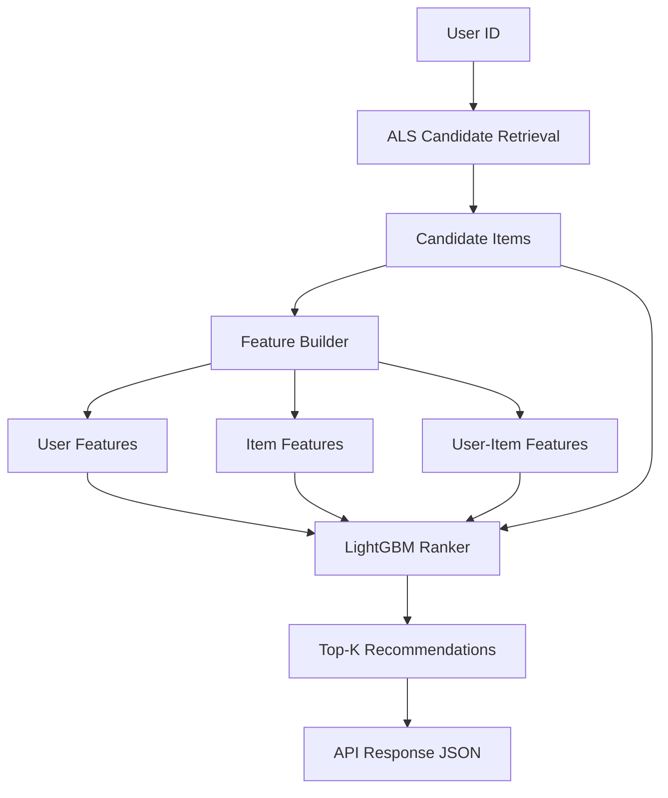
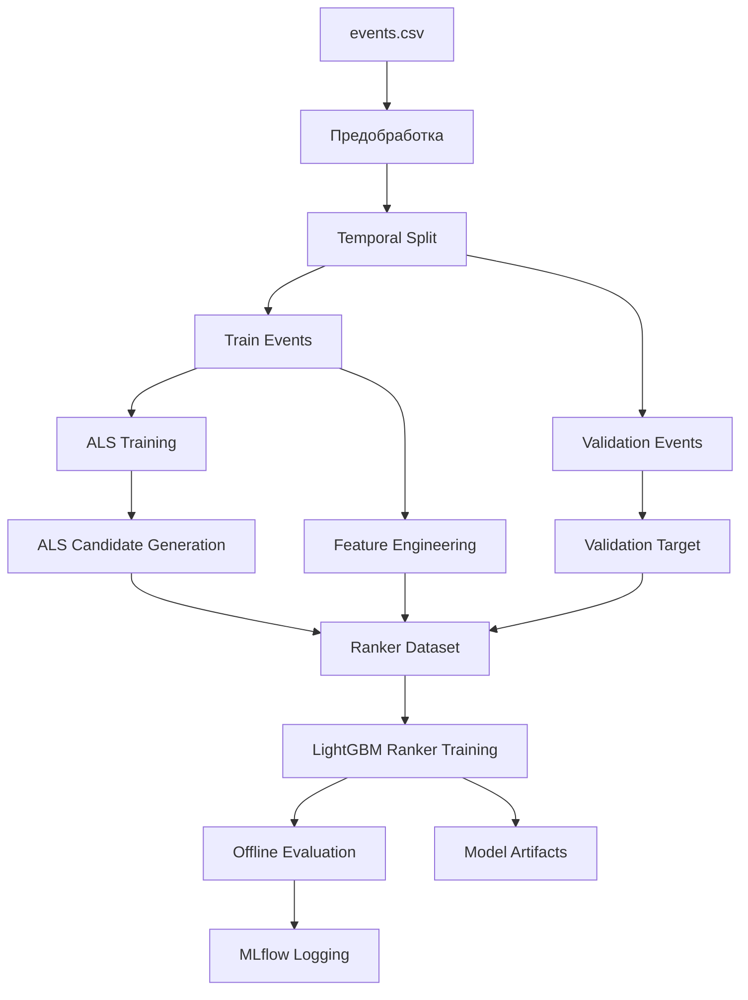
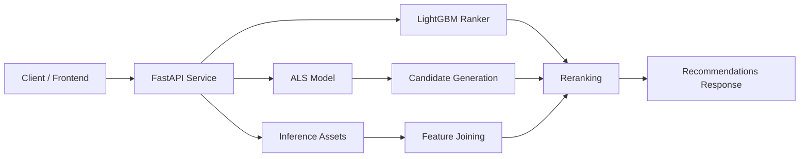
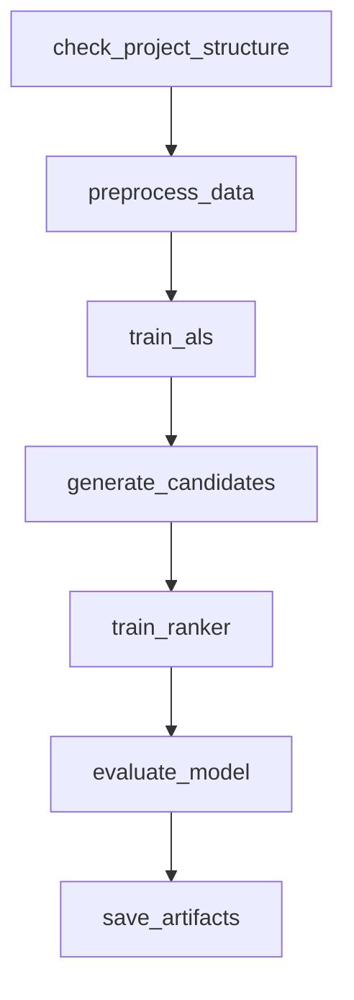
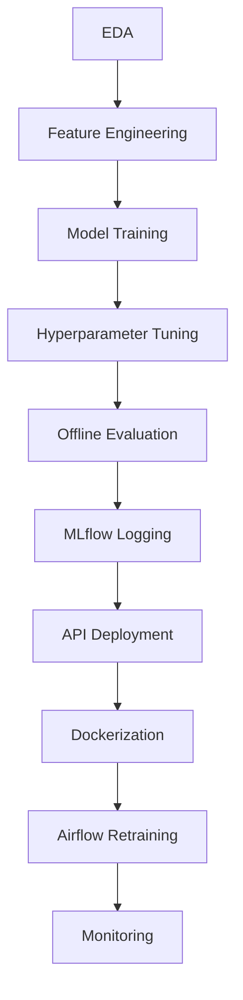

# 🛒 Рекомендации товаров в электронной коммерции

## Описание проекта

Цель проекта — построить production-ready рекомендательную систему для интернет-магазина, которая предсказывает наиболее релевантные товары для пользователя.

Проект покрывает полный ML lifecycle:

* исследование данных;
* feature engineering;
* обучение и сравнение моделей;
* hyperparameter tuning;
* логирование экспериментов;
* деплой API-сервиса;
* контейнеризация;
* автоматическое переобучение;
* мониторинг;
* документация и сопровождение.

---

## Архитектура системы

```mermaid
flowchart LR
    A[Исторические события] --> B[Предобработка данных]
    B --> C[Feature Engineering]
    B --> D[ALS Candidate Retrieval]
    C --> E[User Features]
    C --> F[Item Features]
    C --> G[User-Item Features]
    D --> H[Candidate Pool]
    E --> I[LightGBM Ranker]
    F --> I
    G --> I
    H --> I
    I --> J[Top-K Recommendations]
````

---

## Данные

Используются три таблицы:

### `category_tree.csv`

Содержит иерархию категорий товаров:

* `parentid` — родительская категория
* `categoryid` — дочерняя категория

### `events.csv`

История пользовательских событий:

* `timestamp`
* `visitorid`
* `event`
* `itemid`
* `transactionid`

Типы событий:

* `view`
* `addtocart`
* `transaction`

### `item_properties.csv`

История изменения свойств товаров:

* `timestamp`
* `itemid`
* `property`
* `value`

---

## Постановка задачи

Необходимо рекомендовать пользователю товары, которые с высокой вероятностью приведут к добавлению в корзину.

### Целевое действие

Основной таргет:

* `addtocart`

Дополнительные сигналы:

* `transaction` — сильный позитивный сигнал
* `view` — слабый позитивный сигнал

Также из рекомендаций исключаются уже купленные товары.

---

## Метрики

### Offline Ranking Metrics

* Recall@K
* Precision@K
* MAP@K
* NDCG@K
* HitRate@K

Основная метрика:

* **Recall@10**

Дополнительные:

* MAP@10
* NDCG@10

---

### Business Metrics

* CTR рекомендаций
* Add-to-Cart Rate
* Conversion to Purchase
* GMV Uplift

---

## Подход к решению

Задача решается как **Learning-to-Rank**.

Используется двухэтапная архитектура:

```text
Candidate Generation → Ranking
```

---

## Candidate Generation

Используются retrieval-модели:

* Top Popular
* ALS
* Item-to-Item
* Recently Popular
* Category-Based

---

## Ranking

Используется модель:

* **LightGBM Ranker**

Признаки:

* user behavior features
* item popularity features
* user-item interaction features
* time/context features
* ALS score

---

## Inference Pipeline



---

## EDA

Основные выводы:

* высокая разреженность interaction matrix
* выраженный cold-start
* long-tail распределение пользователей и товаров
* `addtocart` — наиболее сильный proxy target
* вечер — пик пользовательской активности
* свойства товаров дают значимый прирост качества

Результат анализа:

* `notebooks/01_eda.ipynb`

---

## Эксперименты

Сравниваются модели:

* Top Popular
* ALS
* Two-Stage Hybrid Model

Результаты:

* `notebooks/02_modeling.ipynb`

---

## Ablation Study

| Model                    | Recall@10 |
| ------------------------ | --------- |
| ALS Only                 | baseline  |
| Ranker without ALS score | improved  |
| Ranker with ALS score    | best      |

Вывод:

> ALS score является важным дополнительным ranking-сигналом.

---

## Offline Training Pipeline



---

## MLflow

### Запуск сервера

```bash
mlflow server \
  --backend-store-uri sqlite:///mlflow.db \
  --default-artifact-root ./mlruns \
  --host 127.0.0.1 \
  --port 5000
```

---

### Логируются

* параметры моделей
* offline-метрики
* Optuna trials
* feature importance
* артефакты моделей

---

## API Service

Рекомендательная система развёрнута как FastAPI REST сервис.

---

### Endpoints

#### Healthcheck

```http
GET /health
```

---

#### Recommendations

```http
POST /recommend
```

Request:

```json
{
  "user_id": 257597,
  "top_k": 10,
  "n_candidates": 100
}
```

Response:

```json
{
  "user_id": 257597,
  "recommendations": [
    {
      "item_id": 3574,
      "score": 0.913,
      "als_score": 0.184,
      "categoryid": 1173
    }
  ]
}
```

---

### Swagger

```text
http://localhost:8000/docs
```

---

## API Deployment Architecture



---

## Docker

### Build

```bash
docker build -t ecommerce-recsys .
```

### Run

```bash
docker run -p 8000:8000 ecommerce-recsys
```

---

## Airflow Retraining Pipeline

Реализован автоматический DAG переобучения модели.

---

### DAG Stages

1. Загрузка данных
2. Предобработка
3. Обучение ALS
4. Генерация candidate pool
5. Обучение Ranker
6. Offline evaluation
7. Сохранение артефактов

---

### DAG Visualization



---

### Schedule

* Weekly retraining

---

## Monitoring

Реализован мониторинг inference и retraining pipeline.

---

### API Metrics

* `http_requests_total`
* `http_request_latency_seconds`
* `recommend_requests_total`
* `recommend_request_latency_seconds`
* `recommendations_returned_total`
* `inference_errors_total`

---

### Retraining Metrics

* `retrain_runs_total`
* `retrain_failures_total`
* `retrain_duration_seconds`

---

### Metrics Endpoint

```http
GET /metrics
```

---

## Monitoring Architecture

```mermaid
flowchart LR
    A[FastAPI API] --> B[/metrics]
    C[Retraining Pipeline] --> D[Pushgateway / Metrics Export]
    B --> E[Prometheus]
    D --> E
    E --> F[Dashboards / Alerts]
```

---

## Структура проекта

```text
ecommerce-recsys/
├── README.md
├── MONITORING.md
├── requirements.txt
├── requirements-api.txt
├── Dockerfile
├── notebooks/
│   ├── 01_eda.ipynb
│   └── 02_modeling.ipynb
├── data/
│   └── processed/
├── models/
│   ├── als_model.bin
│   ├── lgbm_ranker.bin
│   └── inference_assets.pkl
├── scripts/
│   └── train_recommender_pipeline.py
├── airflow/
│   └── dags/
│       └── retrain_recsys.py
├── src/
│   ├── api/
│   └── inference/
```

---

## Локальный запуск

```bash
git clone <repo_url>
cd ecommerce-recsys

python3 -m venv .venv
source .venv/bin/activate
pip install -r requirements.txt
```

---

## Запуск API

```bash
uvicorn src.api.main:app --host 0.0.0.0 --port 8000
```

---

## Полный Retraining вручную

```bash
python scripts/train_recommender_pipeline.py --stage preprocess
python scripts/train_recommender_pipeline.py --stage train_als
python scripts/train_recommender_pipeline.py --stage generate_candidates
python scripts/train_recommender_pipeline.py --stage train_ranker
python scripts/train_recommender_pipeline.py --stage evaluate
python scripts/train_recommender_pipeline.py --stage save_artifacts
```

---

## Используемый стек

* Python
* Pandas / Polars / NumPy
* Implicit ALS
* LightGBM
* FastAPI
* Docker
* Airflow
* Prometheus
* MLflow
* Optuna

---

## Итог

Особенности данных:

* высокая разреженность
* cold-start
* long-tail распределение

Итоговое решение:

> **Production-ready двухэтапная рекомендательная система**
>
> **ALS Candidate Retrieval + LightGBM Ranker Reranking**

---

## Full ML Lifecycle



---

## Автор

**Andrej Moldovan**

Рекомендации товаров в электронной коммерции

```
```
